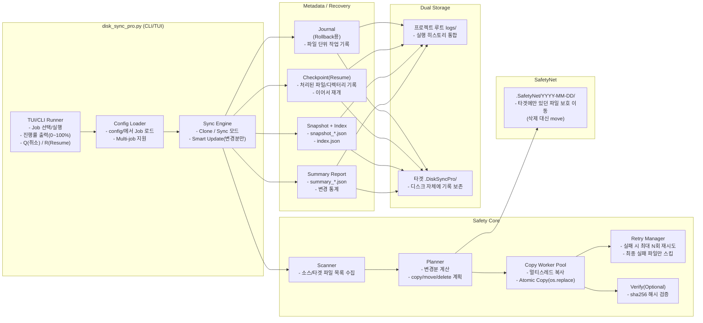
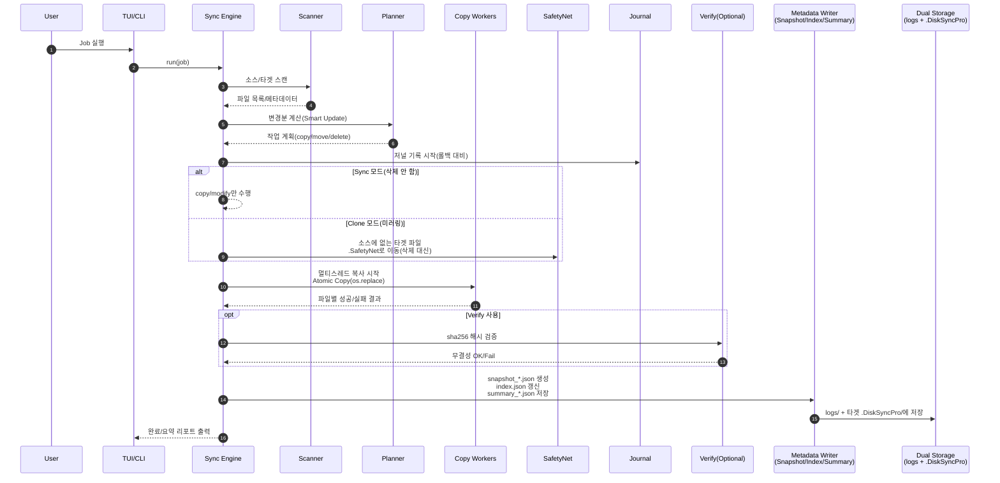
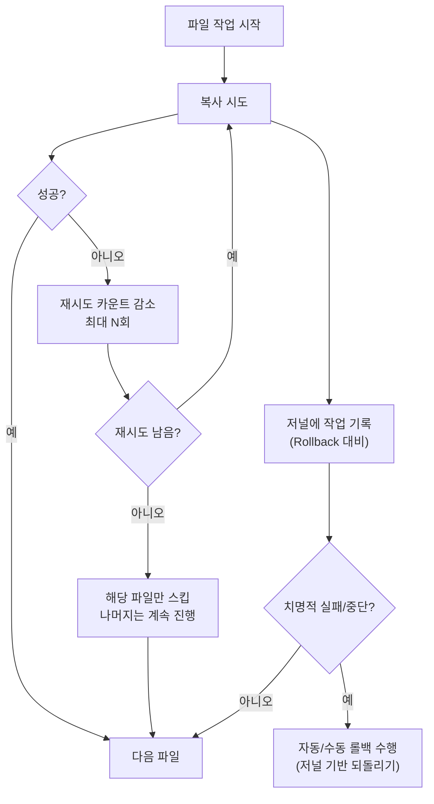
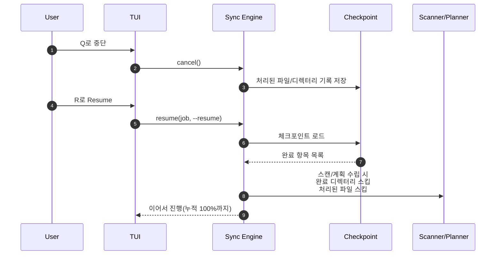

# DiskSyncPro  
Mac용 안전한 디스크 백업/동기화 도구
(Carbon Copy Cloner + SuperDuper + Time Machine 컨셉)

---

## 소개

이 프로젝트는 **외장 SSD → 외장 SSD**, 혹은 **폴더 → 폴더** 형태로  
데이터를 안전하게 백업하고 동기화하는 Python 기반 도구입니다.

Time Machine처럼 **변경분만 증분 백업**하고,  
Carbon Copy Cloner·SuperDuper처럼 **스냅샷 느낌의 안전 복사 + Smart Update**를 구현했습니다.

백업 중 오류가 발생하더라도:

- 자동 롤백
- 파일 단위 보호
- SafetyNet 폴더 보존
- 실패한 파일만 스킵하고 나머지는 계속 진행
- 중간에 끊겨도 `--resume` 으로 이어서 재시도

가 되도록 설계되어 있어, 대용량 외장 SSD 백업을 비교적 안전하게 수행할 수 있습니다.

---

## 주요 기능

| 기능 | 설명 |
|------|------|
| Smart Update | 변경된 파일만 복사하여 빠르고 효율적인 백업 (Time Machine 느낌) |
| SafetyNet | 소스에 없는 파일을 삭제 대신 `.SafetyNet/YYYY-MM-DD/`로 이동 |
| Clone 모드 | 대상 폴더를 소스와 완전히 동일하게 미러링 (不要 파일 삭제) |
| Sync 모드 | 추가/변경만 반영, 삭제는 하지 않는 안전 동기화 |
| Rollback | 실패 시 자동/수동 되돌리기 지원 (저널 기반) |
| Atomic Copy | 임시 파일에 복사 후 `os.replace`로 교체해 파일 단위 무결성 보장 |
| 재시도 시스템 | 복사 실패 시 최대 N회까지 자동 재시도 후, 안 되면 그 파일만 스킵 |
| Dry-run 지원 | 실제로 실행하기 전, 어떤 작업이 수행될지 시뮬레이션 |
| Verify (옵션) | 파일 복사 후 해시(sha256) 비교로 무결성 검증 |
| Multi-job 지원 | 하나의 설정 파일로 여러 백업 작업을 정의하고 실행 |
| Snapshot 인덱스 | 백업 완료 시 대상 경로 전체 스냅샷(JSON) 및 인덱스(`index.json`) 생성 |
| Resume Checkpoint | 중간에 끊겨도 `--resume` 옵션으로 이어서 백업 재개 |
| 변경 요약 리포트 | Job별 변경 내역 통계를 `summary_*.json`으로 저장 |
| 진행률 표시 | 전체 대상 파일 기준 0–100% 진행률을 로그로 출력 |
| **메타데이터 이중 저장** | 저널/스냅샷/요약을 `logs/`와 타겟의 `.DiskSyncPro/` 모두에 저장 |
| **안전한 TUI** | curses 에러 방지를 위한 안전한 화면 출력 (한글 지원) |
| **멀티스레드 복사** | CPU 코어 수 기반 자동 스레드 최적화로 빠른 백업 |

---

## 전체 구조(컴포넌트) 다이어그램


## 백업/동기화 1회 실행 흐름(시퀀스)


## 실패/복구 관점(저널 롤백 + 재시도 + 스킵)


## Resume(중단 후 재개) 흐름


---

## 요구사항

- macOS / Linux 환경
- Python **3.9 이상**
- 표준 라이브러리만 사용 (추가 패키지 설치 불필요, `requirements.txt` 없음)

---

## 🔄 Resume 기능 (중단 후 재시작)

**중단된 백업을 이어서 실행**할 수 있습니다:

### 사용 방법

1. **백업 중 취소**: `Q` 키로 백업 취소
2. **즉시 재시작**: `R` 키로 같은 작업 Resume
3. **메뉴에서 재시작**: 메인 메뉴 → 1번 선택 → Resume Y 선택

### Resume 최적화

- **디렉토리 단위 스킵**: 완료된 디렉토리는 스캔하지 않음
- **파일 단위 체크포인트**: 처리된 파일만 기록
- **무한 Resume 가능**: R → R → R 계속 가능

```bash
# 예시: 239,093개 파일 백업
1차 시도: 50,000개 처리 (21%) → Q로 취소 → R로 재시작
2차 시도: 120,000개 처리 (50%) → Q로 취소 → R로 재시작  
3차 시도: 239,093개 완료 (100%) ✓
```

---

## 메타데이터 이중 저장

**v2.0부터** 백업 시 생성되는 모든 메타데이터(저널, 스냅샷, 요약)가 **두 곳**에 저장됩니다:

1. **`logs/` 폴더** (프로젝트 루트)
   - 백업 실행 기록 보관용
   - 여러 백업 작업의 히스토리 통합 관리

2. **타겟 디스크의 `.DiskSyncPro/` 폴더**
   - 백업된 디스크 자체에 메타데이터 보존
   - 디스크를 다른 곳에 연결해도 백업 히스토리 확인 가능
   - 실제 복사된 파일 정보와 완벽한 싱크 보장

### 저장되는 정보

```
/Volumes/WORK_BACKUP/
├── .DiskSyncPro/
│   ├── journal_WORK-to-WORK_BACKUP_20251204_145526.json  # 롤백용 저널
│   ├── summary_20251204_145526.json                      # 변경 요약
│   └── snapshots/
│       ├── snapshot_20251204_145526.json                 # 전체 파일 목록
│       └── index.json                                    # 스냅샷 인덱스
├── (실제 백업된 파일들...)
└── .SafetyNet/                                           # 삭제된 파일 보호
```

이제 **타겟 디스크 자체가 완전한 백업 아카이브**가 됩니다!

---

## 설치

```bash
git clone <your-repo-url>
cd DiskSyncPro
